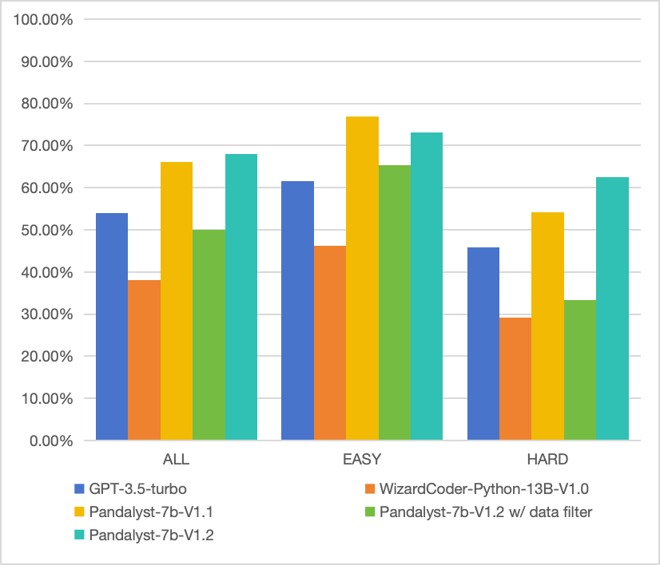
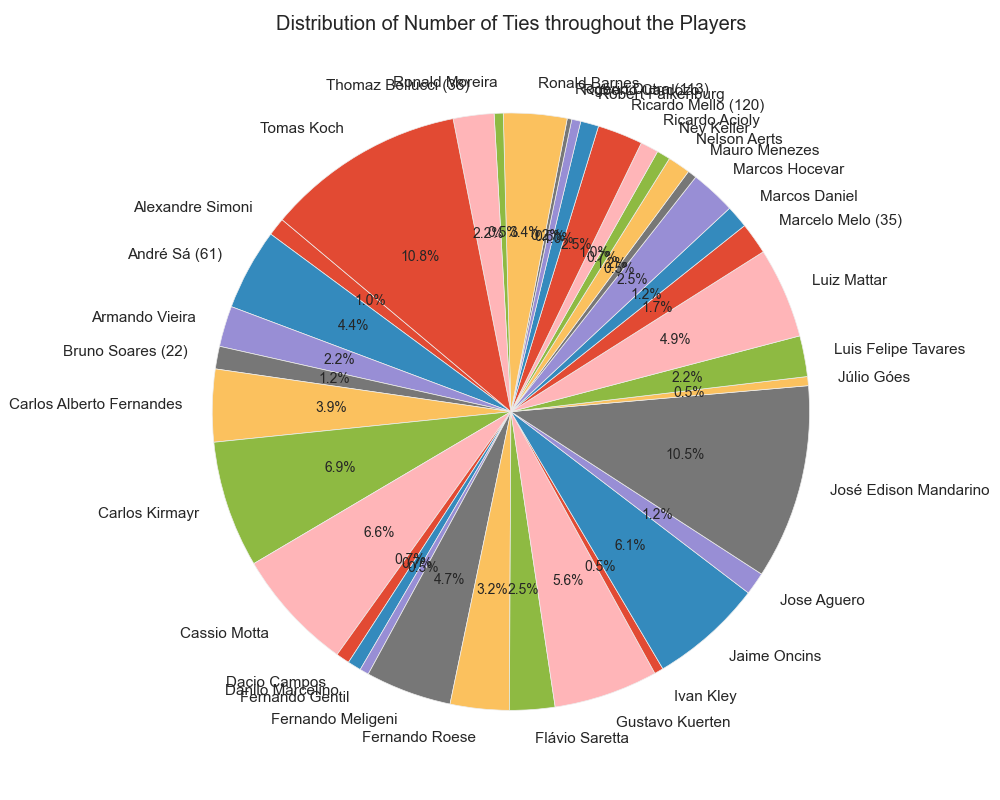
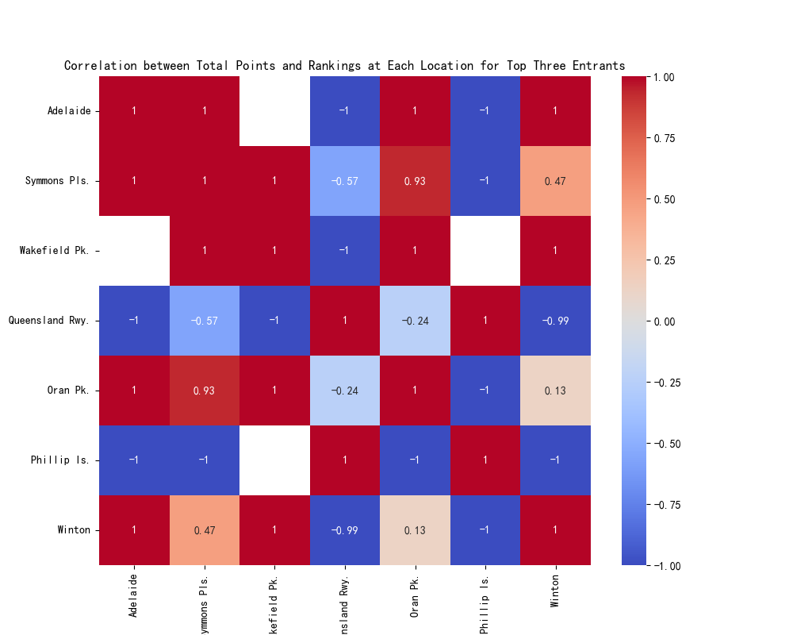
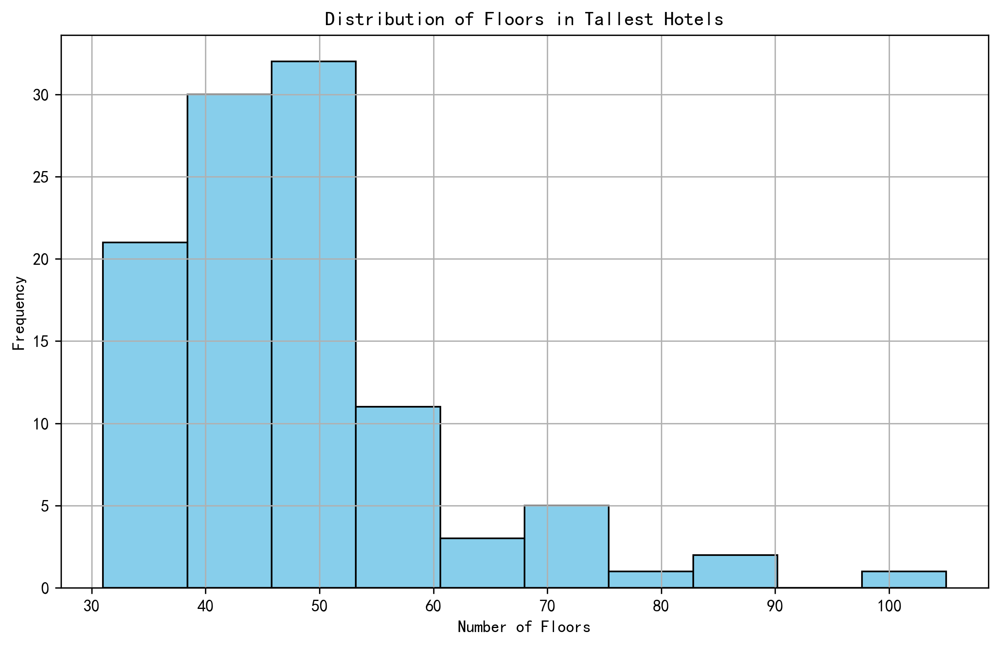

## Pandalyst: A large language model for mastering data analysis using pandas


<p align="center">
    
</p>


[](https://pandas.pydata.org/)
[](https://www.python.org/downloads/release/python-390/)

**What is Pandalyst**
- Pandalyst is a general large language model specifically trained to process and analyze data using the pandas library.

**How is Pandalyst**
- Pandalyst has strong generalization capabilities for data tables in different fields and different data analysis needs.

**Why is Pandalyst**
- Pandalyst is open source and free to use, and its small parameter size (7B) allows us to easily deploy it on local PC. 
- Pandalyst can handle complex data tables (multiple columns and multiple rows), allowing us to enter enough context to describe our table in detail.
- Pandalyst has very competitive performance, significantly outperforming models of the same size and even outperforming some of the strongest closed-source models.

## News
- 🔥[2023/10/15] Now we can **plot** 📈! and much more powerful! We released **Pandalyst-7B-V1.2**, which was trained on **CodeLlama-7b-Python** and it surpasses **ChatGPT-3.5 (2023/06/13)**, **Pandalyst-7B-V1.1** and **WizardCoder-Python-13B-V1.0** in our **PandaTest_V1.0**.
- ⚠️️[2023/10/12] We found that using only executable code for training can lead to models **cheating** and tending to use crude data preprocessing methods, and it is inappropriate to use executable rate as an indicator. We will try to fix these issues in the next model release.
- 🔧[2023/10/11] Support the model to generate multiple codes at the same time (just set **try_n**), and select the executable code for execution.
- 🤖️[2023/09/30] We released **Pandalyst-7B-V1.1** , which was trained on **CodeLlama-7b-Python** and achieves the **76.1 exec@1** in our **PandaTest_V1.0** and surpasses **WizardCoder-Python-13B-V1.0** and **ChatGPT-3.5 (2023/06/13)**.

| Model               | Checkpoint                                                                                 | Support plot | License |
|---------------------|--------------------------------------------------------------------------------------------|--------------|  ----- | 
| 🔥Pandalyst-7B-V1.2 | 🤗 <a href="https://huggingface.co/pipizhao/Pandalyst-7B-V1.2" target="_blank">HF Link</a> | ✅            |  <a href="https://ai.meta.com/resources/models-and-libraries/llama-downloads/" target="_blank">Llama2</a>  |
| Pandalyst-7B-V1.1   | 🤗 <a href="https://huggingface.co/pipizhao/Pandalyst-7B-V1.1" target="_blank">HF Link</a> | ❌            |  <a href="https://ai.meta.com/resources/models-and-libraries/llama-downloads/" target="_blank">Llama2</a>  |

---
## Performance

### QA-Performance
- We build **PandaTest_V1.0**, including **88** high-quality tables filtered from <a href="http://websail-fe.cs.northwestern.edu/TabEL/" target="_blank">WikiTables</a> with **352** data analysis questions of varying difficulty levels by **GPT-4**. The testing tables are unseen during the training and validation stage.

⚠️ The metric **Executable Rate of Generated Code** was drop.

**Human evaluation of Generated code**

- Similar to most work, we use GPT-4 as a judge to judge whether the code and answers generated by the model are correct.
- Specifically, we randomly selected 50 samples in our test set and manually judged the accuracy of the answers by comparing with the answers generated by GPT-4.
- It is worth noting that even the answers generated by GPT-4 may not be accurate, so this metric can only be used as a reference value and cannot fully represent the performance difference between the models and GPT-4.

**Pandalyst-7B-V1.2 vs others**

| Model                | ALL_acc  | Easy_acc | Hard_acc |
|----------------------|----------|----------|----------| 
| WizardCoder-Python-13B-V1.0 | 0.38     | 0.46     | 0.29     |
| GPT-3.5-turbo-0613   | 0.54     | 0.62     | 0.46     |
| Pandalyst-7b-V1.1    | 0.66     | **0.77** | 0.54     |
| **Pandalyst-7b-V1.2** | **0.68** | 0.73     | **0.63** |


<p align="left">
    
</p>

- Thank you for your understanding that manually evaluating the accuracy of code takes a lot of time.

### Plot-Performance
Building

## Case show
### QA
**Task 1**
```
Dataframe Name: Career summary, with 43 rows and 9 columns.
Description: This is a table about Gabriel Furlán: Career summary
Columns: Season, Series, Team, Races, Wins, Poles, Podiums, Points, Position
Here are the descriptions of the columns of the dataframe:
{"Column Name": "Season", "Type": "int", "MIN": 1984, "MAX": 2011}
{"Column Name": "Wins", "Type": "string", "Enumerated Values": ["0", "6", "2", "3", "7", "?", "5", "1"]}
{"Column Name": "Position", "Type": "string", "Enumerated Values": ["9th", "18th", "2nd", "10th", "N/A", "13th", "7th", "4th", "6th", "3rd", "8th", "?", "1st", "16th", "11th", "19th", "5th"]}
{"Column Name": "Podiums", "Type": "string", "Enumerated Values": ["9", "0", "3", "7", "?", "5", "1", "4"]}
{"Column Name": "Team", "Type": "string", "Enumerated Values": ["INI Competición", "Junior Team", "Forti Corse", "GF Motorsport", "GF Racing", "Toyota Team Argentina", "Gustavo Sommi", "Ford", "DTA", "Maldonado Competición", "Sommi-Zanón", "Bainotti Dowen Pagio", "Scuderia 111", "Jolly Club"]}
{"Column Name": "Races", "Type": "string", "Enumerated Values": ["9", "8", "13", "2", "7", "14", "18", "?", "5", "1", "12", "4", "11"]}
{"Column Name": "Points", "Type": "string", "Enumerated Values": ["39", "90", "67", "0", "35.5", "79", "78", "52", "N/A", "16", "38", "26", "65", "144", "1", "139", "175", "42", "32", "46"]}
{"Column Name": "Series", "Type": "string", "Enumerated Values": ["Monaco Grand Prix Formula Three", "TC 2000", "Fórmula 2 Codasur", "Stock Car Brasil", "Formula Renault Argentina", "International Formula 3000", "Super Turismo V8", "World Cup Formula 3000", "Top Race V6", "Top Race V6 Copa América", "Formula Three Sudamericana", "Italian Formula Three", "TC 2000 Endurance series"]}
{"Column Name": "Poles", "Type": "string", "Enumerated Values": ["0", "2", "3", "?", "5", "1", "4"]}
Question: 
Can we analyze the correlation between the number of races Gabriel Furlán participated in each season and the number of wins he achieved in the same season?
```
**Code 1**
```python
def analyze_data(df: pd.DataFrame) ->str:
    df['Races'] = df['Races'].replace(['?', 'N/A'], '0')
    df['Wins'] = df['Wins'].replace(['?', 'N/A'], '0')
    df['Races'] = pd.to_numeric(df['Races'])
    df['Wins'] = pd.to_numeric(df['Wins'])
    df_grouped = df.groupby('Season').agg({'Races': 'sum', 'Wins': 'sum'})
    correlation = df_grouped['Races'].corr(df_grouped['Wins'])
    if correlation > 0:
        return 'There is a positive correlation between the number of races Gabriel Furlán participated in each season and the number of wins he achieved in the same season.'
    elif correlation < 0:
        return 'There is a negative correlation between the number of races Gabriel Furlán participated in each season and the number of wins he achieved in the same season.'
    else:
        return 'There is no correlation between the number of races Gabriel Furlán participated in each season and the number of wins he achieved in the same season.'

# There is a positive correlation between the number of races Gabriel Furlán participated in each season and the number of wins he achieved in the same season.
```
-----
**Task 2**
```
Dataframe Name: Stations, with 45 rows and 6 columns.
Description: This is a table about Shimabara Railway Line: Stations
{"Column Name": "Location", "Type": "string", "Enumerated Values": ["Shimabara-gaikō – Kazusa: Discontinued on April 1, 2008", "Nagasaki Prefecture"]}
{"Column Name": "Japanese", "Type": "string", "Enumerated Values": ["安徳", "浦田観音", "大三東", "有家", "Shimabara-gaikō – Kazusa: Discontinued on April 1, 2008", "島原外港", "多比良町", "神代町", "龍石", "諫早", "堂崎", "西有家", "蒲河", "島鉄湯江", "幸", "深江", "瀬野深江", "愛野", "阿母崎", "森山", "釜ノ鼻", "西郷", "秩父が浦", "布津", "口之津", "東大屋", "大正", "原城", "吾妻", "三会", "布津新田", "干拓の里", "島鉄本社前", "本諫早", "常光寺前", "松尾町", "加津佐", "島原", "南島原", "北有家", "有馬吉川", "諫早東高校前", "小野本町", "古部", "白浜海水浴場前"]}
{"Column Name": "Connecting lines", "Type": "string", "Enumerated Values": ["JR Kyushu : Nagasaki Main Line , Ōmura Line", "Shimabara-gaikō – Kazusa: Discontinued on April 1, 2008"]}
{"Column Name": "Station", "Type": "string", "Enumerated Values": ["Jōkōjimae", "Dōzaki", "Saiwai", "Shimabara", "Taishō", "Higashi-ōya", "Hon-Isahaya", "Ōmisaki", "Fukae", "Arimayoshikawa", "Shimatetsu-honshamae", "Uratakannon", "Kazusa", "Kita-arie", "Isahaya-higashi-kōkōmae", "Azuma", "Shimatetsu-Yue", "Matsuomachi", "Kamaga", "Moriyama", "Aino", "Harajō", "Tairamachi", "Tatsuishi", "Chichibu-ga-ura", "Shimabara-gaikō", "Kobe", "Futsu", "Nishi-arie", "Kantakunosato", "Abozaki", "Antoku", "Isahaya", "Kuchinotsu", "Onohonmachi", "Kōjiromachi", "Futsu-shinden", "Kamanohana", "Shirahama-kaisuiyokujōmae", "Seno-fukae", "Minami-Shimabara", "Arie", "Mie", "Saigō", "Shimabara-gaikō – Kazusa: Discontinued on April 1, 2008"]}
{"Column Name": "Distance (km)", "Type": "string", "Enumerated Values": ["44.3", "43.2", "41.5", "65.3", "76.8", "74.6", "20.8", "14.4", "58.4", "59.9", "Shimabara-gaikō – Kazusa: Discontinued on April 1, 2008", "1.5", "52.0", "7.5", "67.1", "40.5", "78.5", "49.6", "34.1", "9.6", "70.6", "45.4", "23.0", "56.9", "12.4", "29.4", "31.8", "16.6", "19.6", "61.2", "35.2", "5.5", "11.4", "66.1", "37.5", "68.2", "25.5", "75.8", "4.8", "63.4", "53.9", "47.5", "42.3", "0.0", "2.9"]}
{"Column Name": "Express Stops", "Type": "string", "Enumerated Values": ["｜", "●", "Shimabara-gaikō – Kazusa: Discontinued on April 1, 2008", "▲"]}

Can you identify the pattern or frequency of express stops across different locations, and which locations have the maximum and minimum frequency of express stops?
```
**Code 2**
```python
import pandas as pd
import numpy as np

def analyze_data(df: pd.DataFrame) -> str:
    # Prepare: Preprocessing and cleaning data if necessary
    # Replace 'Shimabara-gaikō – Kazusa: Discontinued on April 1, 2008' with NaN
    df.replace('Shimabara-gaikō – Kazusa: Discontinued on April 1, 2008', np.nan, inplace=True)

    # Process: Manipulating data for analysis (grouping, filtering, aggregating, etc.)
    # Group by 'Location' and 'Express Stops' and count the frequency
    express_stops_by_location = df.groupby(['Location', 'Express Stops']).size().reset_index(name='Frequency')

    # Analyze: Conducting the actual analysis
    # Find the location with maximum and minimum frequency of express stops
    max_frequency_location = express_stops_by_location[express_stops_by_location['Frequency'] == express_stops_by_location['Frequency'].max()]['Location'].values[0]
    min_frequency_location = express_stops_by_location[express_stops_by_location['Frequency'] == express_stops_by_location['Frequency'].min()]['Location'].values[0]

    # Output: Returning the answer as a string
    return f"The location with maximum frequency of express stops is {max_frequency_location} and the location with minimum frequency of express stops is {min_frequency_location}."
```
----
### Plot
1. plot a bar chart to visualize the number of participants from each entrant or organization in the Championship
```python
def plot_chart(df: pd.DataFrame):
    # Prepare: Preprocessing and cleaning data if necessary
    # Replace '–' with 0 and convert the columns to numeric
    df.replace('–', 0, inplace=True)
    for col in df.columns:
        if col != "":
            df[col] = pd.to_numeric(df[col])

    # Process: Manipulating data for analysis (grouping, filtering, aggregating, etc.)
    # Group by the entrant or organization and sum the participants
    df_grouped = df.groupby("").sum()

    # Analyze: Conducting the actual analysis
    # No specific analysis needed as we are just plotting the data

    # Plot: Creating a chart and saving it to an image in './temp_chart.png' (do not show the chart)
    plt.figure(figsize=(10,6))
    plt.bar(df_grouped.index, df_grouped.values, color='blue')
    plt.xlabel('Entrant or Organization')
    plt.ylabel('Number of Participants')
    plt.title('Number of Participants from Each Entrant or Organization in the Championship')
    plt.xticks(rotation=90)
    plt.tight_layout()
    plt.savefig('./temp_chart.png', dpi=300)
    plt.close()
```

<p align="left">
    
</p>

2. Construct a heat map to showcase the correlation between the total points garnered and the rankings at each of the Championship locations for the top three entrants.
```python
def plot_chart(df: pd.DataFrame):
    for col in df.columns:
        if col != '':
            df[col] = pd.to_numeric(df[col], errors='coerce')
    top_three_entrants = df.sort_values(by='Total', ascending=False).head(3)
    correlation_matrix = top_three_entrants.drop('Total', axis=1).corr()
    plt.figure(figsize=(10, 8))
    sns.heatmap(correlation_matrix, annot=True, cmap='coolwarm')
    plt.title('Correlation between Total Points and Rankings at Each Location for Top Three Entrants')
    plt.savefig('./temp_chart.png')
```
<p align="left">
    
</p>

3. Generate a histogram of the 'Floors' column to understand the distribution of the number of floors in these hotels.
```python
def plot_chart(df: pd.DataFrame):
    plt.figure(figsize=(10, 6))
    plt.hist(df['Floors'], bins=10, color='skyblue', edgecolor='black')
    plt.title('Distribution of Floors in Tallest Hotels')
    plt.xlabel('Number of Floors')
    plt.ylabel('Frequency')
    plt.grid(True)
    plt.savefig('./temp_chart.png', dpi=300, bbox_inches='tight')
    plt.close()
```
<p align="left">
    
</p>

---

## Usage
### Preparation
```python
import transformers
from infer import infer
import pandas as pd
import torch

model_name = "pipizhao/Pandalyst-7B-V1.2"

model = transformers.AutoModelForCausalLM.from_pretrained(
    model_name,
    device_map = "auto",
    torch_dtype=torch.bfloat16)

tokenizer = transformers.AutoTokenizer.from_pretrained(model_name)

df = pd.DataFrame({"name":["Mike","Tony","Sally"],
                   "score":[98, 97, 99],
                   "gender":["boy","boy","girl"]})

df_name = "score sheet" # Optional
df_description = "score sheet of class 1" # Optional
```

### QA
```python
question = "Who is the boy with the highest score?"
answer, function_code = infer(df,
                              question=question,
                              model=model,
                              tokenizer=tokenizer,
                              df_name=df_name,
                              df_description=df_description,
                              try_n = 1)

print(function_code)
# def analyze_data(df: pd.DataFrame) ->str:
#     if df.isnull().values.any():
#         df = df.dropna()
#     df_boy = df[df['gender'] == 'boy']
#     max_score_boy = df_boy[df_boy['score'] == df_boy['score'].max()]
#     return max_score_boy['name'].values[0]

print(answer)
# The boy with the highest score is Mike.
```

### Plot
```python
question = "Please help me draw a pie chart of the ratio of boys and girls in school"
answer, function_code = infer(df,
                              question=question,
                              model=model,
                              tokenizer=tokenizer,
                              df_name=df_name,
                              df_description=df_description,
                              try_n = 1,
                              plot = True, # poltting task
                              save_img = "./my_img_path")

# the img will be saved in ./my_img_path
```

---
## TO DO
| Todo List                     | state      | Timeline |
|-------------------------------|------------|----------|
| Support plotting capabilities | Done ✅️️   | 1014     |
| Building PandaTest_Plot_V1.0  | Doing ▶️️️ | 10xx     |
| Support multiple tables       | Panding  ⏸ | -        |
| Support debuging capabilities | Panding  ⏸ | -        |

#### Just start 🌟! You can get our latest models as soon as possible.

## 🤝 Contributing

Contributions are welcome! If you can provide any comments or data support, please feel free to contact us or just open a issue!


## Acknowledgements
- This project is based on the pandas library.
- <a href="https://github.com/gventuri/pandas-ai/" target="_blank">PandasAI</a> provided the initial inspiration and a reference to the code execution module.
- Please use our model responsibly.