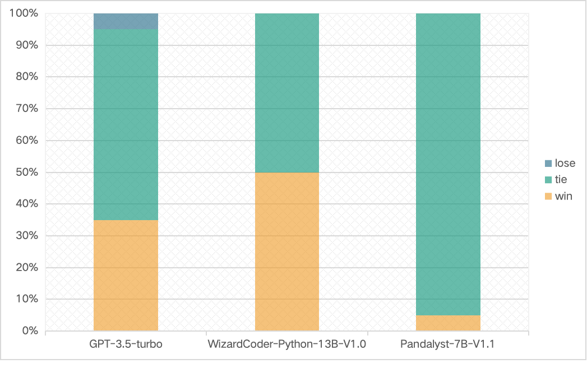
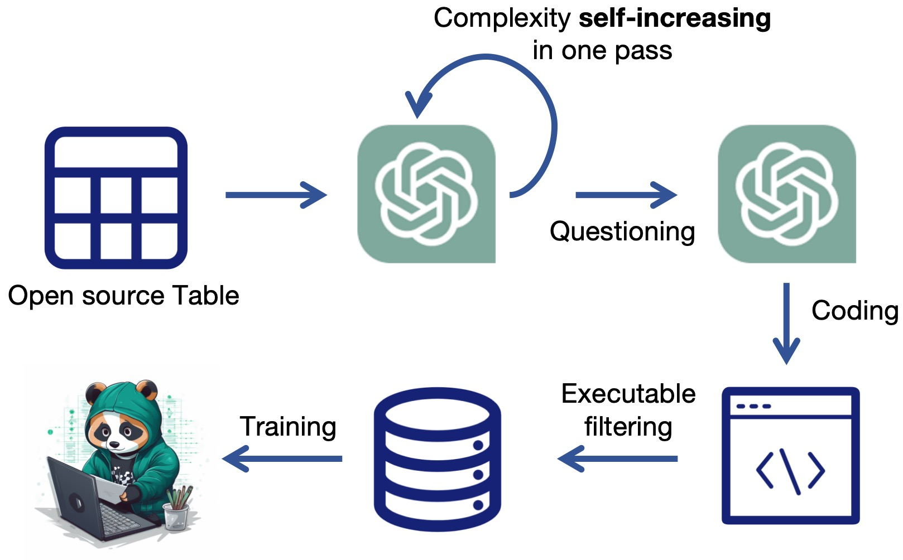

## Pandalyst: A large language model for mastering data analysis using pandas


<p align="center">
    
</p>


[](https://pandas.pydata.org/)
[](https://www.python.org/downloads/release/python-390/)

**What is Pandalyst**
- Pandalyst is a general large language model specifically trained to process and analyze data using the pandas library.

**How is Pandalyst**
- Pandalyst has strong generalization capabilities for data tables in different fields and different data analysis needs.

**Why is Pandalyst**
- Pandalyst is open source and free to use, and its small parameter size (7B/13B) allows us to easily deploy it on local PC. 
- Pandalyst can handle complex data tables (multiple columns and multiple rows), allowing us to enter enough context to describe our table in detail.
- Pandalyst has very competitive performance, significantly outperforming models of the same size and even outperforming some of the strongest closed-source models.

## News

- 🔥[2023/09/28] We released **Pandalyst-13B-V1.0** , which achieves the **70.7 exec@1** in our **PandaTest_V1.0** and surpasses **WizardCoder-Python-13B-V1.0** and **ChatGPT-3.5 (2023/06/13)**.


| Model              | Checkpoint                                                                                           | PandaTest_V1.0 | EASY | HARD | License |
|--------------------|------------------------------------------------------------------------------------------------------|----------------|---------------------|---------------------|  ----- | 
| Pandalyst-13B-V1.0 | 🤗 <a href="https://huggingface.co/pipizhao/Pandalyst_13B_v1.0" target="_blank">HF Link</a> | 70.7           | 75.6                | 65.9                |  <a href="https://ai.meta.com/resources/models-and-libraries/llama-downloads/" target="_blank">Llama2</a>  |
| Pandalyst-7B-V1.0  | coming soon                                                                                          | -              | -                   | -                   |  <a href="https://ai.meta.com/resources/models-and-libraries/llama-downloads/" target="_blank">Llama2</a>  |


## Performance
- We build **PandaTest_V1.0**, including **88** high-quality tables filtered from <a href="http://websail-fe.cs.northwestern.edu/TabEL/" target="_blank">WikiTables</a> with **352** data analysis questions of varying difficulty levels by **GPT-4**.
- The testing tables are unseen during the training and validation stage.

###Metric: **Executable Rate of Generated Code (%)**

| Model                       | PandaTest_V1.0<br/>exec@1 | EASY<br/>exec@1 | HARD<br/>exec@1 |
|-----------------------------|---------------------------|-----------------|-----------------|
| GPT-3.5-turbo-0613          | 58.5                      | 66.5            | 50.6            |
| WizardCoder-Python-13B-V1.0 | 42.0                      | 59.7            | 24.4            |
| Pandalyst-13B-V1.0          | **70.7**                  | **75.6**        | **65.9**        |


<p align="left">
    
</p>

###**Accuracy of Generated Answer (Human evaluation)**

- We randomly selected 20 test sets for manual evaluation and compared the answers generated by Pandalyst and others.
<p align="left">
    
</p>

- Thank you for your understanding that manually evaluating the accuracy of code takes a lot of time.

### Case show

**Task 1**
```
Dataframe Name: Season by season, with 36 rows and 7 columns.
Description: This is a table about Tofaş S.K.: Season by season
{"Column Name": "Postseason", "Type": "string", "Enumerated Values": ["Lower divisions", "Final Group", "–", "Champion", "Runner-up", "Relegated", "Quarterfinalist", "Final Stage 4th", "Semifinalist", "Promoted Champion", "Final Stage", "Promoted"]}
{"Column Name": "European Competitions", "Type": "string", "Enumerated Values": ["Played Korać Cup", "Played Euroleague", "Played European Cup", "EuroChallenge Top 16", "Runner-up Korać Cup", "–", "Lower divisions"]}
{"Column Name": "Division", "Type": "string", "Enumerated Values": ["Lower divisions", "T2BL", "TBL", "TB2L"]}
{"Column Name": "Season", "Type": "string", "Enumerated Values": ["2005–06", "2009–10", "1998–99", "2000–03", "1981–82", "1990–91", "1988–89", "1977–78", "1995–96", "1974–76", "1980–81", "2011–12", "1979–80", "1986–87", "2003–04", "1983–84", "1993–94", "1999–00", "1992–93", "1978–79", "2004–05", "1987–88", "1984–85", "2010–11", "1996–97", "1976–77", "2008–09", "1991–92", "1982–83", "1989–90", "2012–13", "1985–86", "2006–07", "1997–98", "1994–95", "2007–08"]}
{"Column Name": "Tier", "Type": "string", "Enumerated Values": ["2", "Lower divisions", "1"]}
{"Column Name": "Cup Competitions", "Type": "string", "Enumerated Values": ["–", "Champion", "Quarterfinalist", "Lower divisions", "Group Stage"]}
{"Column Name": "Pos.", "Type": "string", "Enumerated Values": ["15", "Lower divisions", "10", "2", "6", "5", "1", "9", "11", "8", "7", "14", "4"]}

Question: 
Analyze the correlation between Tofaş S.K.'s league position ('Pos.') and their performance in European Competitions. Do years of high performance in European Competitions align with high league positions?
```
**Code 1 by Pandalyst-13B-V1.0**
```python
import pandas as pd
import numpy as np

def analyze_data(df: pd.DataFrame) -> str:
    # Preprocessing and cleaning data
    # Convert 'Pos.' column to numeric, errors='coerce' will turn non-numeric values to NaN
    df['Pos.'] = pd.to_numeric(df['Pos.'], errors='coerce')

    # Remove rows where 'Pos.' or 'European Competitions' is NaN
    df = df.dropna(subset=['Pos.', 'European Competitions'])

    # Create a new column 'European Competitions Performance' based on the level of performance in European Competitions
    # '–' and 'Lower divisions' are considered as low performance, others are considered as high performance
    df['European Competitions Performance'] = np.where(df['European Competitions'].isin(['–', 'Lower divisions']), 0, 1)

    # Calculate the correlation between 'Pos.' and 'European Competitions Performance'
    correlation = df['Pos.'].corr(df['European Competitions Performance'])

    # Analyze the correlation and return the answer
    if correlation > 0.5:
        return "Yes, years of high performance in European Competitions align with high league positions."
    else:
        return "No, years of high performance in European Competitions do not align with high league positions."
```
-----
**Task 2**
```
Dataframe Name: Stations, with 45 rows and 6 columns.
Description: This is a table about Shimabara Railway Line: Stations
{"Column Name": "Location", "Type": "string", "Enumerated Values": ["Shimabara-gaikō – Kazusa: Discontinued on April 1, 2008", "Nagasaki Prefecture"]}
{"Column Name": "Japanese", "Type": "string", "Enumerated Values": ["安徳", "浦田観音", "大三東", "有家", "Shimabara-gaikō – Kazusa: Discontinued on April 1, 2008", "島原外港", "多比良町", "神代町", "龍石", "諫早", "堂崎", "西有家", "蒲河", "島鉄湯江", "幸", "深江", "瀬野深江", "愛野", "阿母崎", "森山", "釜ノ鼻", "西郷", "秩父が浦", "布津", "口之津", "東大屋", "大正", "原城", "吾妻", "三会", "布津新田", "干拓の里", "島鉄本社前", "本諫早", "常光寺前", "松尾町", "加津佐", "島原", "南島原", "北有家", "有馬吉川", "諫早東高校前", "小野本町", "古部", "白浜海水浴場前"]}
{"Column Name": "Connecting lines", "Type": "string", "Enumerated Values": ["JR Kyushu : Nagasaki Main Line , Ōmura Line", "Shimabara-gaikō – Kazusa: Discontinued on April 1, 2008"]}
{"Column Name": "Station", "Type": "string", "Enumerated Values": ["Jōkōjimae", "Dōzaki", "Saiwai", "Shimabara", "Taishō", "Higashi-ōya", "Hon-Isahaya", "Ōmisaki", "Fukae", "Arimayoshikawa", "Shimatetsu-honshamae", "Uratakannon", "Kazusa", "Kita-arie", "Isahaya-higashi-kōkōmae", "Azuma", "Shimatetsu-Yue", "Matsuomachi", "Kamaga", "Moriyama", "Aino", "Harajō", "Tairamachi", "Tatsuishi", "Chichibu-ga-ura", "Shimabara-gaikō", "Kobe", "Futsu", "Nishi-arie", "Kantakunosato", "Abozaki", "Antoku", "Isahaya", "Kuchinotsu", "Onohonmachi", "Kōjiromachi", "Futsu-shinden", "Kamanohana", "Shirahama-kaisuiyokujōmae", "Seno-fukae", "Minami-Shimabara", "Arie", "Mie", "Saigō", "Shimabara-gaikō – Kazusa: Discontinued on April 1, 2008"]}
{"Column Name": "Distance (km)", "Type": "string", "Enumerated Values": ["44.3", "43.2", "41.5", "65.3", "76.8", "74.6", "20.8", "14.4", "58.4", "59.9", "Shimabara-gaikō – Kazusa: Discontinued on April 1, 2008", "1.5", "52.0", "7.5", "67.1", "40.5", "78.5", "49.6", "34.1", "9.6", "70.6", "45.4", "23.0", "56.9", "12.4", "29.4", "31.8", "16.6", "19.6", "61.2", "35.2", "5.5", "11.4", "66.1", "37.5", "68.2", "25.5", "75.8", "4.8", "63.4", "53.9", "47.5", "42.3", "0.0", "2.9"]}
{"Column Name": "Express Stops", "Type": "string", "Enumerated Values": ["｜", "●", "Shimabara-gaikō – Kazusa: Discontinued on April 1, 2008", "▲"]}

Can you identify the pattern or frequency of express stops across different locations, and which locations have the maximum and minimum frequency of express stops?
```
**Code 2 by Pandalyst-13B-V1.0**
```python
import pandas as pd
import numpy as np

def analyze_data(df: pd.DataFrame) -> str:
    # Prepare: Preprocessing and cleaning data if necessary
    # Replace 'Shimabara-gaikō – Kazusa: Discontinued on April 1, 2008' with NaN
    df.replace('Shimabara-gaikō – Kazusa: Discontinued on April 1, 2008', np.nan, inplace=True)

    # Process: Manipulating data for analysis (grouping, filtering, aggregating, etc.)
    # Group by 'Location' and 'Express Stops' and count the frequency
    express_stops_by_location = df.groupby(['Location', 'Express Stops']).size().reset_index(name='Frequency')

    # Analyze: Conducting the actual analysis
    # Find the location with maximum and minimum frequency of express stops
    max_frequency_location = express_stops_by_location[express_stops_by_location['Frequency'] == express_stops_by_location['Frequency'].max()]['Location'].values[0]
    min_frequency_location = express_stops_by_location[express_stops_by_location['Frequency'] == express_stops_by_location['Frequency'].min()]['Location'].values[0]

    # Output: Returning the answer as a string
    return f"The location with maximum frequency of express stops is {max_frequency_location} and the location with minimum frequency of express stops is {min_frequency_location}."
```

## Usage
```python
import transformers
from infer import infer
import pandas as pd
import torch

model_name = "pipizhao/Pandalyst_13B_v1.0",

model = transformers.AutoModelForCausalLM.from_pretrained(
    model_name,
    device_map = "auto",
    dtype=torch.bfloat16)

tokenizer = transformers.AutoTokenizer.from_pretrained(model_name)

df = pd.DataFrame({"name":["Mike","Tony","Sally"],
                   "score":[98, 97, 99],
                   "gender":["boy","boy","girl"]})

df_name = "score sheet" # Optional
df_description = "score sheet of class 1" # Optional

question = "Who is the boy with the highest score?"

answer, function_code = infer(df,
                              question=question,
                              model=model,
                              tokenizer=tokenizer,
                              df_name=df_name,
                              df_description=df_description)

print(answer)
```

- Tips: Our model now can only return the answer **as a string**, we are seizing time to build the model's **plotting capabilities**.

## TO DO
| Todo List                                        | state       | Timeline |
|--------------------------------------------------|-------------|----------|
| Realse Pandalyst-13B-V1.0                        | Done     ✅  | 0928     |
| Realse Pandalyst-7B-V1.0                         | Training ▶️ | October  |
| Support plotting capabilities                    | Building ⏸️ | October  |
| Higher quality training and more powerful models | Panding  ⏸  | -        |
| Supports multiple tables                         | Panding  ⏸  | -        |

#### Just start 🌟! You can get our latest models as soon as possible.

## Overview of Our Method

<p align="center">
    
</p>

**We train Pandalyst based on WizardCoder.**
## 🤝 Contributing

Contributions are welcome! If you can provide any comments or data support, please feel free to contact us or just open a issue!


## Acknowledgements
- This project is based on the pandas library.
- <a href="https://github.com/gventuri/pandas-ai/" target="_blank">PandasAI</a> provided the initial inspiration and a reference to the code execution module.
- Great model provided by <a href="https://huggingface.co/WizardLM/WizardCoder-Python-13B-V1.0" target="_blank">WizardCoder</a>, and the sense of **Evol-Instruct** proposed by <a href="https://arxiv.org/abs/2304.12244" target="_blank">WizardLM</a>
- Please use our model responsibly.